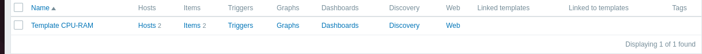
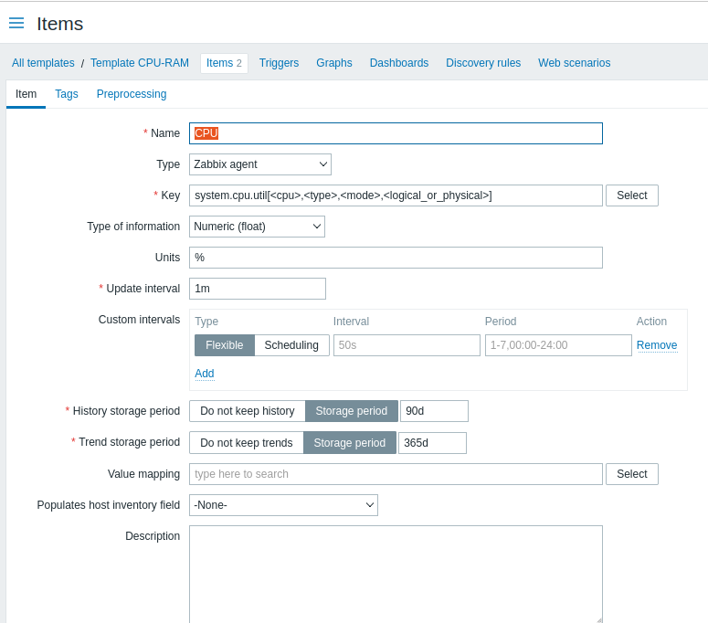
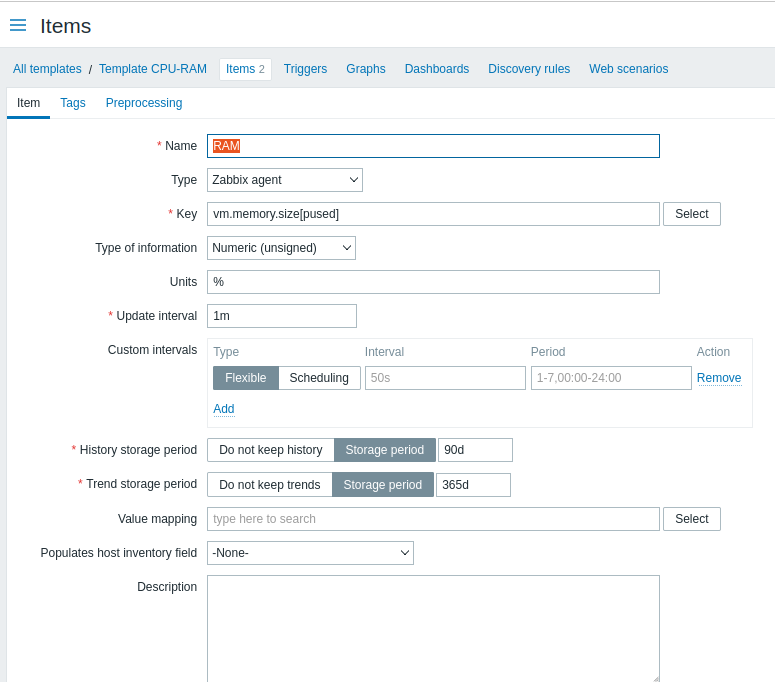
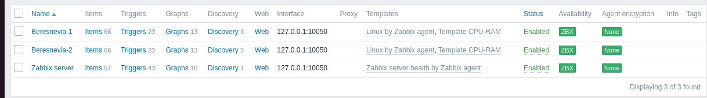
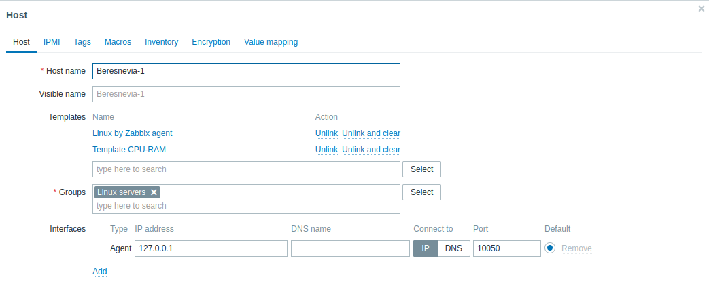
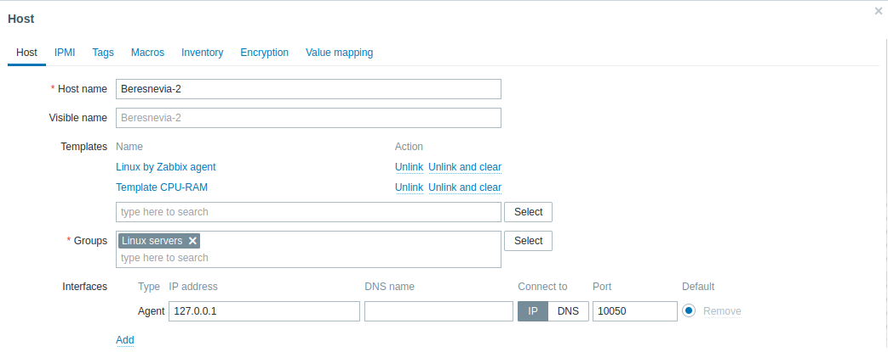
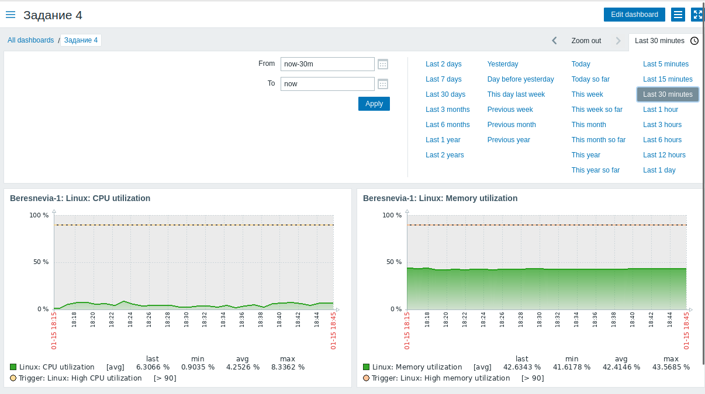

# Домашнее задание к занятию «Система мониторинга Zabbix часть 2»
Выполнил: Береснев Игорь Андреевич

---

## Задание 1 Создайте свой шаблон, в котором будут элементы данных, мониторящие загрузку CPU и RAM хоста

### Скриншот шаблона

### Скриншот первого айтема

### Скриншот второго айтема

## Задание 2-3

Добавьте в Zabbix два хоста и задайте им имена <фамилия и инициалы-1> и <фамилия и инициалы-2>

Привяжите созданный шаблон к двум хостам. Также привяжите к обоим хостам шаблон Linux by Zabbix Agent

### Скриншот хостов

### Скриншот привязанных шаблонов к первому хосту 

### Скриншот привязанных шаблонов к второму хосту 

## Задание 4

Создайте свой кастомный дашборд

### Скриншот кастомного дашборда

